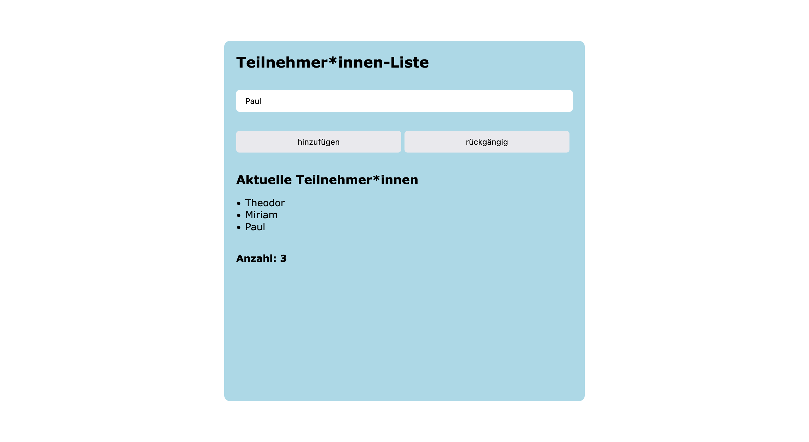

# member-list-using-array | Online member list

This is a solution for an online member list. Simply enter a name in the text field and press the button "hinzufügen" to expand the list. Delete the last entry by clicking on "rückgängig".

## Table of contents

- [Overview](#overview)
  - [The challenge](#the-challenge)
  - [Screenshot](#screenshot)
  - [Links](#links)
- [My process](#my-process)
  - [Built with](#built-with)
- [Author](#author)
- [Acknowledgments](#acknowledgments)

## Overview

### The challenge

Build an HTML form with an input field and two buttons "hinzufügen" for adding and “rückgängig” for deleting the last entry:

- When you click on "hinzufügen", the text that was entered in the form field should be added to an array. At the same time, the array should be written into the HTML. Maybe as a list? Search the internet or documentation for a way.
- If you click on the "rückgängig" button, the last element (added last) should be removed again. In addition, the updated array should be printed out again on the page.
- Think of an attractive design for your list.

### Screenshot

### Links

- Solution URL: [https://github.com/jenniferhubermayer/member-list-using-array](https://github.com/jenniferhubermayer/member-list-using-array)
- Live Site URL: [https://jenniferhubermayer.github.io/member-list-using-array/](https://jenniferhubermayer.github.io/member-list-using-array/)

## My process

### Built with

- Semantic HTML5 markup
- CSS custom properties
- Flexbox
- Mobile-first workflow
- JavaScript (Focused on arrays)

## Author

- Website - [https://github.com/jenniferhubermayer](https://github.com/jenniferhubermayer)

## Acknowledgments

This project has been realized as part of the [https://www.super-code.de/](SuperCode) "Front-End Boot-Camp 2022".
